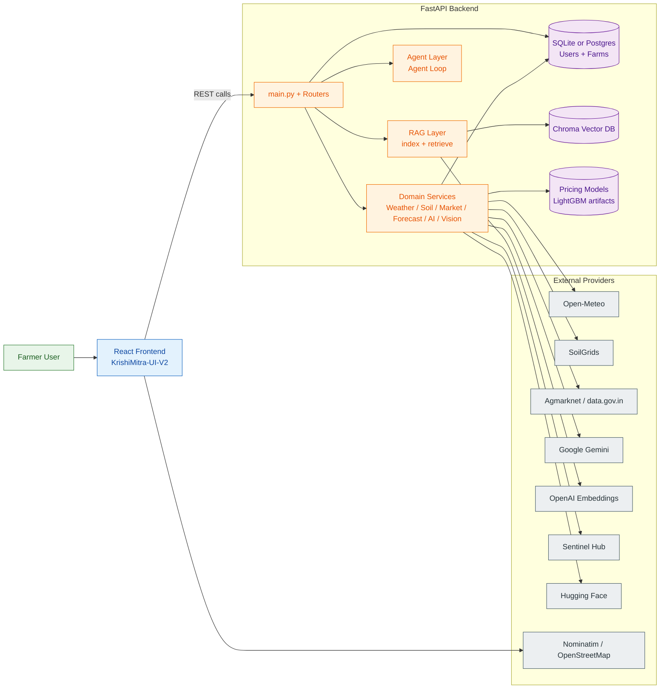
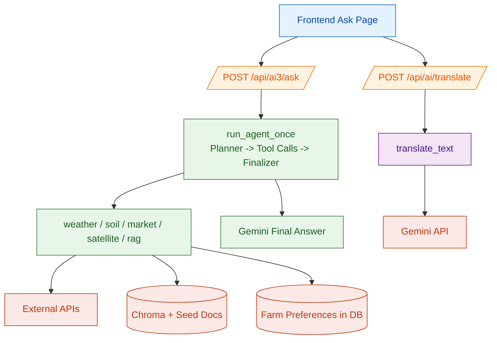

# KrishiMitra AI

KrishiMitra is a full-stack agriculture assistant with a FastAPI backend and a React (Vite + TypeScript) frontend. It combines weather, soil, mandi prices, price forecasting, crop recommendation, disease detection, and agentic AI/RAG capabilities.

This README is based on the current code in this repository.

## What Is Implemented

- User and farm registration/profile management
- Farm preferences (preferred commodities and mandi)
- Market price lookup from Agmarknet (data.gov.in)
- Market metadata and value validation from encoder artifacts
- Quantile price forecasting (p20/p50/p80) using pre-trained LightGBM models
- Weather forecast integration (Open-Meteo)
- Soil analysis integration (SoilGrids)
- Crop recommendation (Gemini + weather/soil context)
- Leaf disease detection (ViT + Gemini post-processing)
- AI chat endpoints:
  - translation endpoint
  - multi-step agent loop with tools (ai3)
  - RAG-backed answer flow
- RAG search and grounded answer over local ingested documents (Chroma + OpenAI embeddings)
- Frontend onboarding and dashboard pages for all core capabilities

## Repository Structure

```text
KrishiMitra-V2/
  backend/
    app/
      agents/
      models/
      rag/
      routers/
      schemas/
      services/
      main.py
    alembic/
    ingestion/
    models/pricing_global/
    tests/
    requirements.txt
  KrishiMitra-UI-V2/
    src/
    package.json
  alembic.ini
  README.md
```

## Architecture Overview

### Backend

- Framework: FastAPI
- ORM/Migrations: SQLAlchemy + Alembic
- Default DB URL: `sqlite:///backend/local.db` (overridable)
- Core app entry: `backend/app/main.py`
- Auto-registered routers for users, farms, market, weather, soil, recommendations, crop disease, AI translate, agentic AI, RAG, and market metadata

### Frontend

- Framework: React 18 + TypeScript + Vite
- State/caching: Context + localStorage cache helpers
- UI: Tailwind + shadcn/ui + Radix
- API client: `KrishiMitra-UI-V2/src/lib/api.ts`

## Architecture Flow Diagram



## AI Paths Diagram



## AI Request Sequence (Ask AI with farm_id)

```mermaid
sequenceDiagram
  autonumber
  participant UI as Frontend (AskAIPage)
  participant API as /api/ai3/ask
  participant DB as Farms DB
  participant LOOP as Agent Loop
  participant TOOLS as Tool Layer
  participant EXT as External APIs
  participant LLM as Gemini

  UI->>API: POST /api/ai3/ask<br/>{question, target_language, farm_id, coords, district}
  API->>DB: Load farm preferences by farm_id
  DB-->>API: preferred_commodities, preferred_mandi
  API->>LOOP: run_agent_once(...prefs...)

  LOOP->>LLM: Planner prompt
  LLM-->>LOOP: tool plan JSON
  LOOP->>TOOLS: Execute planned tools (with timeout/retry)
  TOOLS->>EXT: Weather/Soil/Market/RAG calls
  EXT-->>TOOLS: Tool responses (or partial failures)
  TOOLS-->>LOOP: Structured step results

  LOOP->>LLM: Final synthesis prompt
  LLM-->>LOOP: Final answer
  LOOP-->>API: answer, used_steps, error
  API-->>UI: JSON response
```

## API Surface (High Level)

Base URL: `http://127.0.0.1:8000`

- `GET /` `GET /health` `GET /version`
- `POST /api/users/register`
- `GET /api/users/{user_id}/profile`
- `POST /api/farms/register`
- `GET /api/farms/{farm_id}`
- `GET /api/farms/{farm_id}/preferences`
- `PUT /api/farms/{farm_id}/preferences`
- `GET /api/market/prices`
- `GET /api/market/prices/by-farm/{farm_id}`
- `GET /api/market/forecast`
- `GET /api/market/forecast/by-farm/{farm_id}`
- `GET /api/market/meta/all`
- `GET /api/market/meta/validate`
- `GET /api/weather`
- `GET /api/soil`
- `GET /api/users/{user_id}/recommendations/crop`
- `POST /api/v1/cropdisease/detect`
- `POST /api/ai/translate`
- `POST /api/ai3/ask`
- `POST /api/rag/search`
- `POST /api/rag/answer`

Interactive docs: `http://127.0.0.1:8000/docs`

## Quick Start

### 1. Clone

```bash
git clone <your-repo-url>
cd KrishiMitra-V2
```

### 2. Create Python environment

```bash
python -m venv .venv
```

Windows PowerShell:

```powershell
.\\.venv\\Scripts\\Activate.ps1
```

macOS/Linux:

```bash
source .venv/bin/activate
```

### 3. Install backend dependencies

```bash
pip install -r backend/requirements.txt
```

### 4. Configure environment variables

Create a `.env` file at repository root. Minimum recommended values:

```env
# Core
KM_ENV=dev
KM_DEBUG=true
KM_DATABASE_URL=sqlite:///backend/local.db
KM_CORS_ORIGINS=*

# LLMs
KM_GEMINI_API_KEY=your_gemini_api_key
KM_GEMINI_MODEL=gemini-2.5-flash

# RAG embeddings
OPENAI_API_KEY=your_openai_api_key
OPENAI_EMBED_MODEL=text-embedding-3-small

# Market
KM_DATA_GOV_IN_API_KEY=your_data_gov_in_api_key

# Optional satellite features
SH_CLIENT_ID=your_sentinel_hub_client_id
SH_CLIENT_SECRET=your_sentinel_hub_client_secret

# Optional forecasting model dir override
PRICE_GLOBAL_MODEL_DIR=models/pricing_global
```

### 5. Run DB migrations (optional but recommended)

```bash
alembic upgrade head
```

### 6. Build or rebuild RAG index

```bash
python backend/ingestion/ingest.py
```

### 7. Run backend API

```bash
uvicorn backend.app.main:app --reload --port 8000
```

### 8. Run frontend

```bash
cd KrishiMitra-UI-V2
npm install
npm run dev
```

Frontend default URL is usually `http://localhost:5173`.

## Frontend Environment

Create `KrishiMitra-UI-V2/.env`:

```env
VITE_API_BASE_URL=http://127.0.0.1:8000
VITE_NOMINATIM_URL=https://nominatim.openstreetmap.org
```

## Running Tests

From repository root:

```bash
pytest backend/tests -v
```

Useful variants:

```bash
pytest backend/tests/test_main_users_routes.py -v
pytest backend/tests --cov=backend.app --cov-report=term-missing
```

## Data and Models

- Price forecast artifacts: `backend/models/pricing_global/`
- RAG source docs: `backend/ingestion/seeds/`
- RAG vector store: `backend/chroma/`
- Uploaded disease images: `backend/uploads/`

## Notes

- Satellite tooling is available only when `SH_CLIENT_ID` and `SH_CLIENT_SECRET` are configured.
- RAG endpoints require `OPENAI_API_KEY` for embeddings.
- AI/crop recommendation/disease LLM paths require a Gemini API key.
- This repository currently includes hardcoded fallback secrets in code. For production, move all secrets to environment variables and rotate exposed keys.

## License

See `LICENSE`.
